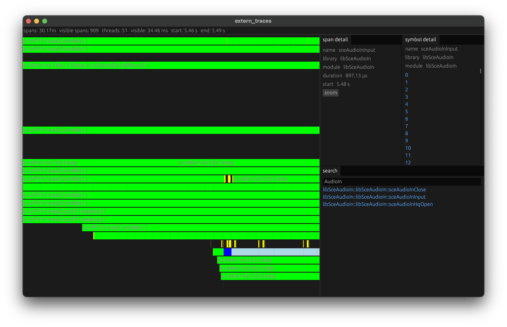

# extern_traces

a low-overhead, realtime trace capture tool for ps4 applications. collects
traces for calls of all non-libc imports for arbitrary applications running on
the ps4.



## installation

1. install `extern_traces.prx`
   * download the latest `extern_traces.prx` from [releases]
   * copy to `/data/GoldHEN/plugins/extern_traces.prx` on a jailbroken ps4
     running GoldHEN 2.3 or newer.
   * ensure the plugin is enabled by adding it to `/data/GoldHEN/plugins.ini`
     ```
     [default]
     /data/GoldHEN/plugins/extern_traces.prx
     ```
   * create a config file `/data/extern_traces.ini`
     ```
     [global]
     ; destination to send traces
     target_address = 192.168.1.104
     target_port = 9090
     
     ; configuration detailed below in "patching targets" section
     [CUSA08010]
     original_tls_size = 0
     ```

2. install trace viewer
   * download the latest binary for your platform from [releases]

## usage

### patching targets

using the tracer with an application requires patching its eboot.bin to extend
its thread local storage segment.

to patch an application, extract it and use the [patch_self.py] on the
application's SELF eboot.bin. i've been using ModdedWarfare's Patch Builder to
extract, patch and rebuild fpkgs. i believe itemzflow's nfs mounting for
unpacked applications may work as well.

update the `/data/extern_traces.ini` with a section for the newly patched title
including the size of the original tls segment.

```
[TITLE_ID]
original_tls_size = 528
```

### capturing

1. start the trace viewer.
   * make sure the ps4 can reach the specified listen port.
   * make sure there is a high quality network link between the ps4 and trace
     collector. trace volume ranges from 10-50MB/s. messages will first spill
     to memory then get dropped if available memory is exceeded on the ps4.

2. with extern_traces.prx loaded, launch the game.

## known issues

* it appears GoldHEN loads plugins midway through library load. some patched
  symbols (< 30%) seem to get overwritten and don't show up in the traces.

* there is currently no indication in the UI that messages are being dropped.
  this information is exposed in the wire protocol and used in server.py.

* the ui doesn't have a mechanism for saving traces. if you want to save
  traces, use `nc -l 9090 > traces.bin` and send traces there instead. this
  file can be opened in the trace viewer.

## troubleshooting

if something doesn't work, search klog for `extern_traces`. please open an
issue along with the following information

* the title and version you're trying to trace
* explain how eboot.bin was patched and loaded onto the ps4
* include the klog (`nc <ps4 addr> 3232`)

## contributing

i want this tool to be generally useful. i want to capture all calls of all
calls to imported symbols for all titles. i'm releasing this to collect
feedback, make sure it is rock solid and to make the lives of people building
GoldHEN plugins, emulators and more, easier. if something is broken, please
open an issue.

if you're building something using this in an interesting way, i want to hear
from you, my email and X DMs are open.

## future plans

* deeper trace information around coordination primitives (locks, threads,
  semaphores, queues)
* collect and display full graphics state
* make the UI useful for more use cases

## special thanks

* illusion for helping me figure out how to hook the global offset table
* options for helping me think through the wait free data structure design
* kiwi for showing me how kernel space ps4 code works
* LightningMods for explaining libc memory allocation constraints

[releases]: https://github.com/0xcaff/extern_traces/releases
[patch_self.py]: https://github.com/0xcaff/extern_traces/blob/main/packages/extern_traces_plugin/patch_self.py
